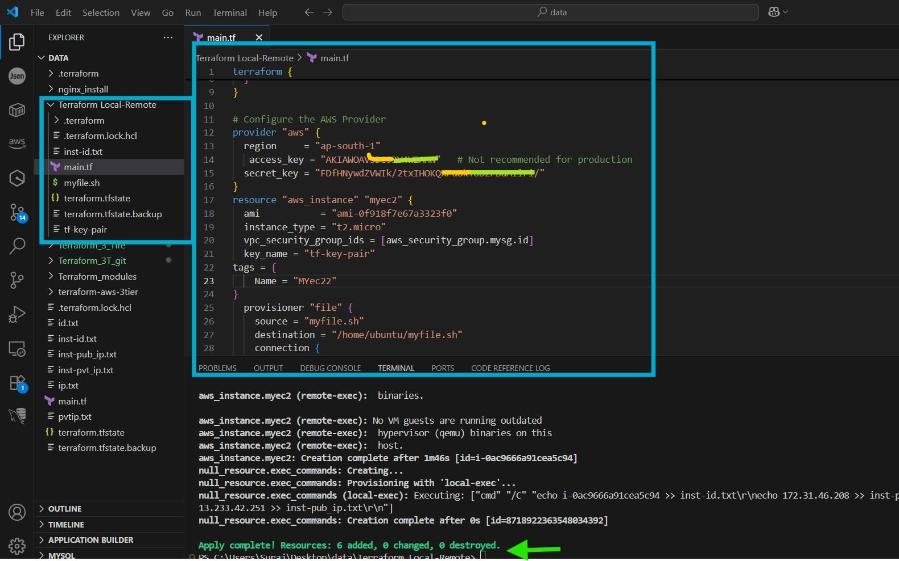
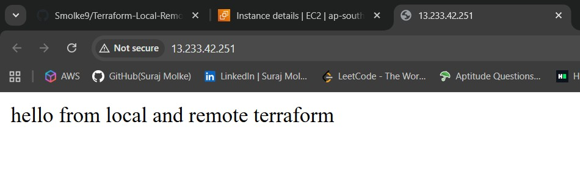

# 🚀 Terraform AWS EC2 Local & Remote Host SSH with Nginx Setup

This project provisions an **AWS EC2 instance** using Terraform, configures security groups, generates SSH key pairs, and installs **Nginx** using a shell script (`myfile.sh`).

---

## 📂 Project Structure

```
.
├── main.tf          # Terraform configuration file
├── myfile.sh        # Script to install and configure Nginx
├── inst-id.txt      # Stores EC2 instance ID
├── inst-pvt_ip.txt  # Stores EC2 private IP
├── inst-pub_ip.txt  # Stores EC2 public IP
└── tf-key-pair      # Generated private key
```

---

## ⚙️ Prerequisites

- Terraform `>= 1.1`
- AWS CLI configured (or provide access/secret keys in provider block)
- An AWS account with permissions to create EC2, Security Groups, and Key Pairs

---

## 📜 Terraform Configuration

### **Provider Configuration**
```hcl
terraform {
  required_version = "~> 1.1"
  required_providers {
    aws = {
      source  = "hashicorp/aws"
      version = "~> 5.0"
    }
  }
}

provider "aws" {
  region     = "ap-south-1"
  access_key = "aKey"   # Use environment variables or AWS CLI in production
  secret_key = "pKey"
}
```

### **Resources Created**
- `aws_instance.myec2` → EC2 instance with Ubuntu AMI
- `aws_security_group.mysg` → Allows SSH (22) and HTTP (80)
- `aws_key_pair.tf-key-pair` → AWS Key Pair
- `tls_private_key.rsa` → Generates private key
- `local_file.tf-key` → Saves private key locally
- `null_resource.exec_commands` → Saves instance details locally

---

## 📜 Shell Script (myfile.sh)

```bash
#!/bin/bash
sudo apt update
sudo apt install nginx -y
sudo service nginx start
cd /var/www/html
sudo rm *.html
sudo echo "hello from local and remote terraform" > index.html
```

This script:
- Updates the system
- Installs **Nginx**
- Starts Nginx service
- Creates a custom `index.html` page

---

## 🚀 Deployment Steps

1. **Clone the repository**
   ```bash
   git clone <your-repo-url>
   cd <your-repo-folder>

    ```



3. **Initialize Terraform**
   ```bash
   terraform init
   ```

4. **Validate configuration**
   ```bash
   terraform validate
   ```

5. **Plan the deployment**
   ```bash
   terraform plan
   ```

6. **Apply the configuration**
   ```bash
   terraform apply -auto-approve
   ```

7. **Access your EC2 instance**
   ```bash
   ssh -i tf-key-pair ubuntu@<EC2_PUBLIC_IP>
   ```

8. **Visit in browser**
   ```
   http://<EC2_PUBLIC_IP>
   ```
   


   You should see:
   ```
   hello from local and remote terraform
   ```

---

## 🗑️ Cleanup

To destroy all resources:
```bash
terraform destroy -auto-approve
```

---

## ⚠️ Notes
- Never hardcode AWS credentials in production. Use **AWS CLI profiles** or environment variables.
- Ensure security group rules are minimal in production for better security.
- Always keep your `tf-key-pair` file safe and never commit it to GitHub.

---

## 📌 Author
Developed by **Suraj Molke** 🚀
